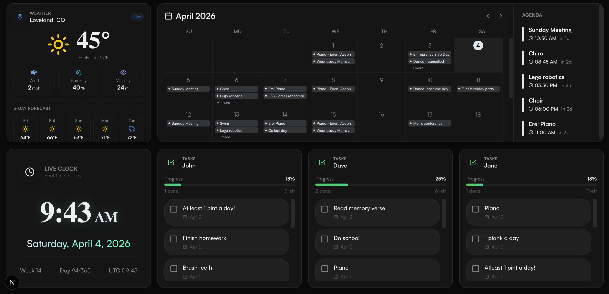
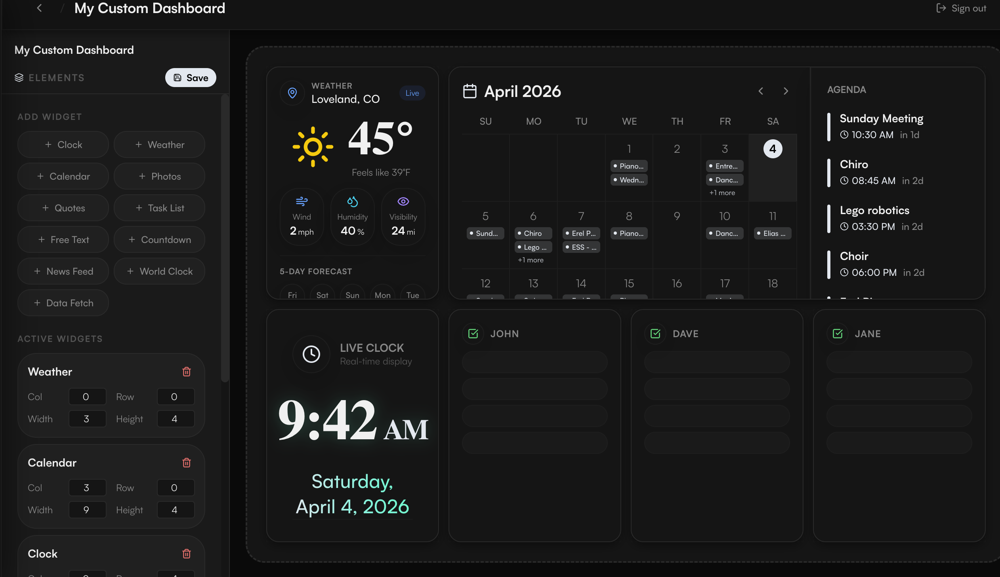
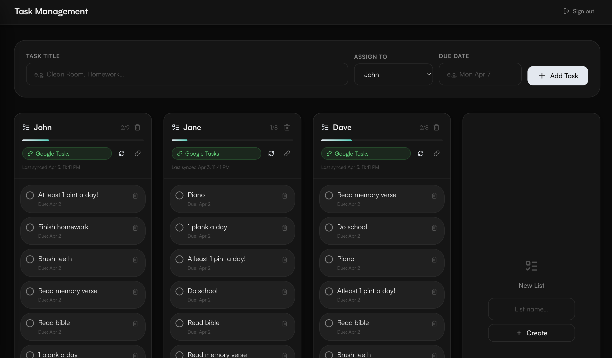
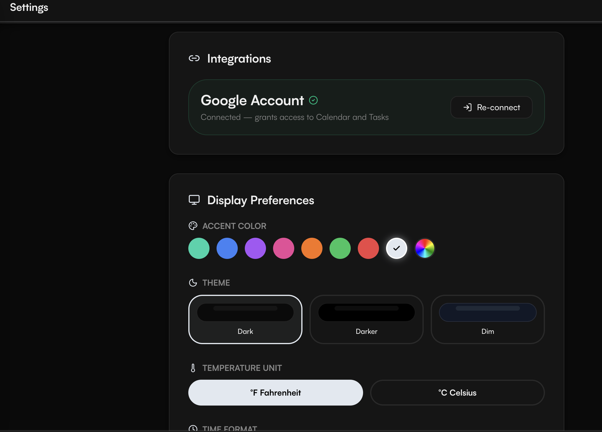

# Vigilboard

A self-hosted personal dashboard designed for always-on wall-mount displays. Built with Next.js 15, Prisma, and SQLite — no cloud accounts required.



---

## Features

### Live Dashboard
- Always-on display optimized for TVs, monitors, and wall-mounted screens
- 12-column × 8-row CSS grid with pixel-perfect widget placement
- Auto-refresh on configurable interval
- Fullscreen mode with hover-to-reveal controls

### Widget Library

| Widget | Description |
|--------|-------------|
| **Clock** | Digital clock with 12h/24h support |
| **Weather** | Current conditions + 5-day forecast via Open-Meteo |
| **Calendar** | Monthly view + agenda panel via Google Calendar |
| **Tasks** | Family task lists with completion tracking |
| **Photos** | Slideshow from uploaded photos |
| **World Clock** | Multiple timezones side by side |
| **News Feed** | RSS headline rotator |
| **Countdown** | Days/hours until any event |
| **Quotes** | Rotating quote display |
| **Free Text** | Custom message with font size and alignment |
| **Data Fetch** | Pull any value from any JSON API |

### Layout Builder



- Drag-and-drop widgets with touch support (mouse, touch, and stylus)
- Resize from the bottom-right corner
- Live widget previews as you build — see exactly what the display will look like
- Per-widget configuration modal

### Google Integration
- Google Calendar — monthly view with event agenda
- Google Tasks — sync task lists per family member
- OAuth 2.0 with automatic token refresh

### Task Management



- Tasks organized by person (e.g. family members)
- Mark complete directly on the live display
- Google Tasks sync with per-list mapping
- Progress bar showing completion percentage

---

## Getting Started

### Prerequisites
- Node.js 18+
- A Google Cloud project with Calendar and Tasks API enabled (for Google integrations)

### Installation

```bash
git clone https://github.com/chetanchadalavada/Vigilboard.git
cd Vigilboard
npm install
```

### Environment

Create a `.env` file in the project root:

```env
DATABASE_URL="file:./dev.db"
GOOGLE_CLIENT_ID=your_google_client_id
GOOGLE_CLIENT_SECRET=your_google_client_secret
NEXT_PUBLIC_APP_URL="http://localhost:3000"
ADMIN_PASSWORD="your-admin-password"
SESSION_SECRET="a-long-random-string"
```

### Database Setup

```bash
npx prisma migrate dev
```

### Run

```bash
npm run dev
```

Open [http://localhost:3000](http://localhost:3000).

- **Admin panel** → `/admin` (password protected)
- **Live display** → `/screen/<id>` (public, for wall-mount)

---

## Architecture

```
src/
├── app/
│   ├── admin/          # Protected admin panel
│   │   ├── screen/[id] # Layout builder
│   │   ├── tasks/      # Task management
│   │   └── settings/   # Google OAuth + display prefs
│   ├── api/            # Route handlers (calendar, tasks, photos, auth)
│   └── screen/[id]/    # Public live display
├── components/
│   └── widgets/        # One file per widget type
└── lib/
    ├── prisma.ts        # DB client singleton
    ├── google-auth.ts   # OAuth + API client helpers
    └── prefs.ts         # Display preferences
```

**Data model:** `Screen` → many `Widget`s (x, y, w, h + JSON config). Tasks stored in `Task` table grouped by `listName`. Global settings (OAuth tokens, preferences) in a `Config` key-value table.

---

## Settings



| Setting | Options |
|---------|---------|
| Temperature unit | Fahrenheit / Celsius |
| Time format | 12h / 24h |
| Display refresh interval | 30s – 5min |
| Accent color | Custom color picker |
| Google account | Connect / disconnect |

---

## Deployment

### Self-hosted (recommended)

Works on any Linux box, Raspberry Pi, or NAS. Run it behind a reverse proxy (nginx, Caddy) with HTTPS if you want remote access.

```bash
npm run build
npm start
```

The SQLite database and uploaded photos are stored locally — no external services required beyond the optional Google integration.

### Raspberry Pi / Wall Mount

Point a Chromium kiosk session at `/screen/<id>` on boot:

```bash
chromium-browser --kiosk --noerrdialogs --disable-infobars http://localhost:3000/screen/<your-screen-id>
```

---

## Tech Stack

- **Framework** — Next.js 15 (App Router, Server Actions)
- **Database** — SQLite via Prisma ORM
- **Styling** — Tailwind CSS v4 + CSS custom properties
- **Auth** — httpOnly session cookie (no third-party auth)
- **APIs** — Google Calendar, Google Tasks, Open-Meteo (weather), RSS/JSON fetch
